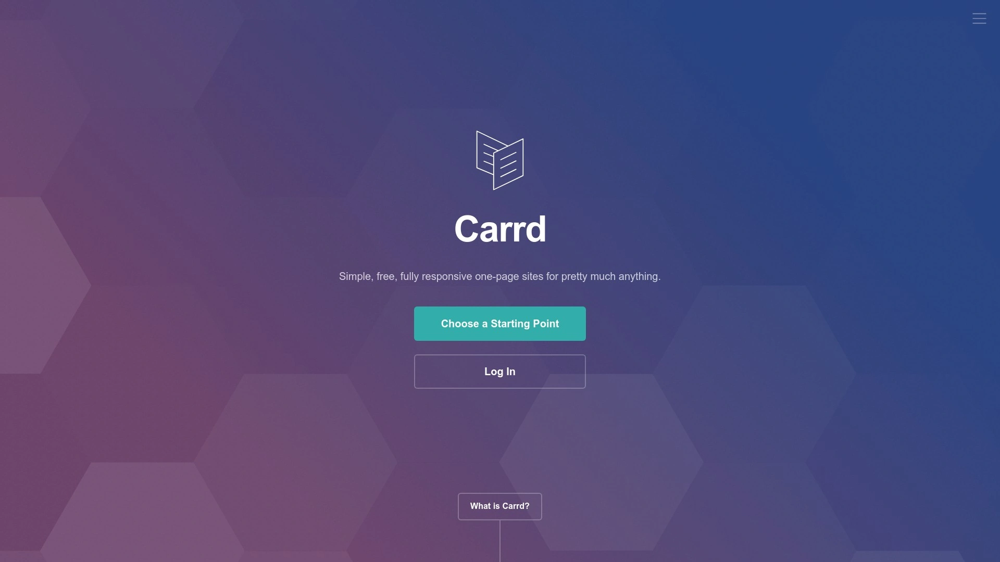

# Learn These 15 Landing Page Software, Complete Lead Generation in Three Minutes

You're probably staring at conversion rates that make you wince. Building landing pages that actually turn visitors into leads shouldn't require a computer science degree or a designer on speed dial. The right landing page software lets you launch professional pages fast, test what works, and watch your email list grow while you sleep. Skip the tech headaches and focus on what matters—getting people to click that signup button.

## **[Leadpages](https://www.leadpages.com)**

Conversion-focused builder with AI-powered tools and 250+ tested templates built specifically for capturing more leads without technical skills.

Think of Leadpages as your shortcut to pages that actually convert. The platform tracks average conversion rates across all its templates, so you're not guessing which design performs better. When you browse templates, you see real data showing how they convert in the wild.

The drag-and-drop builder feels natural. Click any element to edit it right there on the page. Change text inline without opening separate menus. The AI writing assistant generates landing page copy when you tell it your tone and what you're selling. Built-in optimization tips appear as you work, showing a score at the top that tells you how conversion-ready your page is. Click that score and get a checklist of improvements.

Lead enrichment automatically adds details like industry, company size, and location to captured leads. You know more about prospects without asking them extra questions that kill conversions. The platform integrates with 90+ marketing tools so leads flow directly into your CRM or email system. Two-step opt-ins reduce form abandonment by asking for email first, then additional info on the next screen after people commit.

Alert bars and pop-ups promote offers on your existing website. You can even add checkout forms connected to Stripe to sell products directly from landing pages. Mobile-specific customization means you control exactly how pages appear on phones versus desktops.

Best for entrepreneurs testing product ideas quickly, small businesses growing email lists without hiring developers, or agencies managing multiple client campaigns from one dashboard.

## **[Unbounce](https://unbounce.com)**

AI-powered platform combining landing page creation with Smart Traffic technology that automatically routes visitors to page variants most likely to convert them.

Unbounce treats conversion optimization like a science experiment you can actually run. Smart Traffic is the secret weapon here—it learns which visitors convert best on which page variations, then automatically shows people the version they're most likely to act on. No manual traffic splitting or complicated setup.

The drag-and-drop builder requires zero coding but gives you serious control. Over 100 templates provide proven starting points across industries. Smart Builder's Design Assistant makes recommendations based on conversion data from 1.5 billion landing pages. Smart Copy generates AI-powered landing page text, cutting writing time while inspiring your own ideas.

A/B testing runs directly in the platform. Test headlines, images, CTAs, and layouts to continuously improve performance. Dynamic text replacement personalizes pages based on where visitors came from—if someone clicks an ad about "affordable CRM," your landing page headline can mirror that exact phrase automatically.

Integration with your marketing stack happens through direct connections, no workarounds needed. CRM, live chat, marketing automation, call tracking, analytics—it all plugs in cleanly. AMP landing pages load in under 2 seconds, critical since a 2-second delay increases bounce rates by 103%.

Perfect for marketers serious about conversion rate optimization, teams running frequent A/B tests, or businesses where every percentage point of conversion rate translates to significant revenue.

## **[Instapage](https://instapage.com)**

Enterprise-grade builder with collaboration features, 500+ layouts, and the only platform offering built-in team collaboration for creating landing pages at scale.

Instapage separates itself with features big marketing teams actually need. Built-in collaboration lets team members leave feedback directly in the builder, streamlining page creation without endless email threads. Everyone gets individual logins with assigned roles.

The platform provides over 500 customizable layouts tested for conversion, plus Instablocks and Global Blocks you can save, reuse, and update globally across campaigns. AI content generation creates headlines, paragraphs, and CTAs based on your ad group and audience without leaving the builder. This matters when you're launching dozens of campaign variations.

Heatmaps show where visitors click and how they interact with your pages. A/B testing compares different versions to identify what drives action. Dynamic text replacement and AdMaps connect specific ads to unique landing pages for better relevance. Personalization features let you tailor experiences based on audience demographics or behaviors.

The no-code drag-and-drop interface keeps things accessible despite the advanced features. Mobile optimization happens automatically but you can customize the mobile experience separately. Built-in analytics track page performance, conversion rates, and visitor behavior.

Suited for marketing agencies managing multiple clients, enterprise teams coordinating across departments, or businesses running complex campaigns that need personalized landing pages for different audience segments.

## **[ClickFunnels](https://www.clickfunnels.com)**

Complete sales funnel system with landing pages, checkout forms, email automation, and membership sites all designed to move people from discovery to purchase.

ClickFunnels flips the usual approach. Instead of starting with page design, you start with the customer journey. The AI Funnel Builder asks questions about your business goals and creates an optimized funnel within seconds. You get landing pages, thank you pages, upsell pages, and email sequences—the whole sales process.

Pre-built funnels exist for webinar signups, product launches, lead generation, course enrollments, and memberships. Each funnel is structured to capture leads, nurture through emails, and close sales without figuring out technical setup. The drag-and-drop editor customizes everything. Add order bumps and upsells to increase average order value right in the checkout process.

Built-in apps handle course hosting, community building, email automation, and appointment scheduling inside the same system. This integration means marketing, product delivery, and customer management all feed into the funnel. You're not juggling separate platforms with different logins.

The focus stays on monetization. If you're used to platforms where course creation comes first, ClickFunnels feels different—selling comes first, product creation follows. This makes it powerful for entrepreneurs focused on revenue but less structured for pure content creators.

Ideal for course creators and coaches selling programs, eCommerce businesses wanting complete sales funnels, or anyone building membership sites who needs landing pages, checkout, and delivery in one place.

## **[Wix Landing Pages](https://www.wix.com/landing-page-builder)**

Free landing page builder with 110+ templates, drag-and-drop freedom, and built-in email marketing tools that work for simple lead capture campaigns.

Wix makes landing pages accessible to literally anyone. The drag-and-drop editor gives total design flexibility without code. Click and move elements anywhere on the page. The AI landing page generator creates complete pages based on your business goals, then you fine-tune manually.

The platform integrates with virtually every major marketing tool—MailChimp, HubSpot, Facebook Ads, Google Ads. Built-in email marketing and social media tools let you design campaigns within Wix and launch them directly. Wix Analytics connects to Google Analytics, Google Tag Manager, Meta Pixel, Crazy Egg, and Hotjar for deep visitor behavior insights.

Online forms capture leads with countdown timers and form builders you can customize completely. A/B testing compares page versions to improve conversion. SEO tools for landing pages help you rank organically. Advanced analytics show traffic sources, visitor behavior, and lead capture by channel.

The free plan works well for testing concepts but includes Wix subdomain and branding. You need paid plans for custom domains. Paid plans start at $17/month, reasonable for the features included. The platform scales from simple one-pagers to full websites if your needs grow.

Perfect for beginners wanting something simple to start, small businesses on tight budgets, or anyone who values design flexibility and doesn't need advanced conversion features like Smart Traffic or complex A/B testing.

## **[Swipe Pages](https://swipepages.com)**

AMP landing page specialist delivering pages that load in under 2 seconds with mobile-slide experience that boosts conversions through app-like interaction.

Speed is Swipe Pages' obsession. AMP (Accelerated Mobile Pages) are served from Google's cache and pre-loaded for instantaneous experiences. You get lower cost per click from Google Ads because fast-loading pages improve ad quality scores.

Smart Pages creates the coolest mobile experience in the landing page world. When someone accesses your page on mobile, they're routed to a mobile-slide version where they swipe to move through content instead of scrolling. This app-like experience feels smoother for mobile users and legitimately boosts conversions.

The visual editor is straightforward with great template selection. Code optimization, caching, CDN hosting, and image compression automatically speed up pages. Over 40 conversion-optimized templates provide starting points. Dynamic text passes data from ads to landing pages for personalized experiences.

Multi-step forms transform long forms into bite-sized steps, encouraging completion. Sub-accounts organize projects and provide role-based access for teams or clients. Connect to Stripe to sell products directly from pages. Native integrations and Zapier connections transfer leads to your CRM or email tools.

Best for marketers obsessed with page speed and mobile optimization, anyone running Google Ads campaigns who wants lower cost per click, or agencies managing multiple clients who need fast project organization.

## **[GetResponse](https://www.getresponse.com)**

All-in-one platform combining AI-powered landing page creation with email marketing, automation, and webinar hosting for complete campaign management.

GetResponse has evolved from basic email marketing into a comprehensive system. The AI landing page builder creates custom pages optimized for your keywords and industry in clicks. Over 200 templates cover different use cases. The drag-and-drop editor makes customization simple.

Live chat embedded on landing pages lets you engage visitors in real-time, answering questions that might prevent signups. Popups and forms triggered by time on page or scroll depth capture subscribers. A/B testing identifies which elements drive conversions.

The integrated email marketing is where GetResponse shines. Segment leads collected through landing pages, then nurture them with automated email sequences. Autoresponders, workflow automation, conversion funnels—it's all built in. You can run webinars from the same platform, useful for high-ticket sales.

SEO tools let you edit meta tags, URLs, alt text, and add custom CSS/JavaScript. The free plan offers decent features but limits some functionality. Paid plans start at just $15.58/month, making this seriously affordable for the features included.

Ideal for small businesses wanting landing pages and email marketing in one tool, webinar marketers who need integrated registration pages, or anyone prioritizing affordability without sacrificing essential features.

## **[HubSpot Landing Pages](https://www.hubspot.com/products/marketing/landing-pages)**

Free CRM-connected landing page builder where every captured lead automatically enters your sales pipeline with full activity history and engagement tracking.

HubSpot's landing pages connect directly to their CRM, creating a seamless flow from visitor to customer. When someone fills out a form, they instantly appear in your CRM with complete contact information and landing page interaction history. No manual exports or imports.

The drag-and-drop builder requires zero IT help. Choose from templates, customize with your brand, and publish. Lead capture forms collect prospect information directly into your database. A/B testing compares headlines, images, and CTAs to optimize conversion rates.

Built-in analytics track landing page views, form submissions, conversion rates, and which traffic sources drive the best leads. SEO suggestions help pages rank organically. The platform scales—you can build complete websites using the same builder if needed.

The free version provides core landing page and CRM functionality, genuinely useful for small businesses. Premium plans start at $800/month, which jumps significantly but includes advanced automation, reporting, and campaigns with 2,000 marketing contacts.

Perfect for businesses already using HubSpot's ecosystem, sales teams wanting leads automatically added to CRM pipelines, or startups needing free landing pages and basic CRM to get started.

## **[Landingi](https://landingi.com)**

Pixel-perfect drag-and-drop builder with 400+ templates, over 170 marketing integrations, and automation features designed specifically for digital marketers scaling campaigns.

Landingi has spent over a decade perfecting landing page creation. The drag-and-drop editor is intuitive yet powerful, letting you customize every element in detail on both desktop and mobile views separately. The mobile version builds automatically from desktop but can be rearranged anytime.

AI Assistant generates text, SEO content, images, and translations directly in the platform. EventTracker monitors performance with built-in analytics. A/B testing identifies winning variations. Form builder captures leads with customizable fields that integrate with 170+ marketing tools including email platforms, CRMs, analytics, payment systems, and communication tools.

Templates number over 400, categorized by industry and campaign goal. You can publish to your own domain, embed in WordPress, or use a Landingi subdomain. Smart Sections, duplication, and categorization help manage multiple projects and complex campaigns.

All plans include unlimited landing pages and conversions. The catch is Landingi doesn't mention extra costs for third-party integrations you'll likely need. Pricing starts around $70/month for basic plans. The platform has earned a 4.8/5 rating on Capterra, indicating strong user satisfaction.

Best for digital marketing agencies running campaigns at scale, businesses needing extensive third-party tool integrations, or marketers who prioritize pixel-perfect design control and want AI assistance.

## **[OptimizePress](https://www.optimizepress.com)**

WordPress plugin transforming your WordPress site into a conversion machine with landing pages, sales funnels, membership sites, and course delivery all inside WordPress.

OptimizePress gives WordPress users landing page power without leaving their familiar ecosystem. The OptimizeBuilder plugin creates pages using a drag-and-drop visual editor with real-time editing—no back-end loading and guessing.

Over 40 landing page templates cover businesses, webinars, affiliate pages, eBooks, and optin forms. All forms are GDPR compliant and mobile responsive. Sales page templates help convert visitors into buyers with countdown timers, progress bars, videos, and other conversion elements.

Marketing funnels drive visitors from subscribers to customers. Create unique sales processes—send subscribers to free training, then offer upgrades with discount codes. Connect dozens of email marketing services or use Zapier for thousands more integrations. Shopping cart solutions process payments directly.

SmartTheme is included—a minimal WordPress theme optimized for lead generation with built-in opt-in forms you can place anywhere on posts and pages. The Suite plan ($199/year for 20 websites) includes OptimizeFunnels for marketing automation and OptimizeUrgency for scarcity alerts.

Perfect for WordPress users who want landing pages without learning new platforms, bloggers monetizing through sales funnels, or agencies building client sites who need landing pages, membership areas, and course delivery in WordPress.

## **[Kartra](https://kartra.com)**

Complete business platform combining landing pages with funnels, email automation, membership sites, video hosting, helpdesk, calendar, and management in one ecosystem.

Kartra is what happens when marketers build software for marketers. Founded by internet marketing experts Mike Filsaime and Andy Jenkins, the platform handles almost every aspect of online business. Landing pages are just the beginning.

The page builder is highly customizable with SEO optimization built in. Integration with WordPress is seamless—create the page in Kartra, grab the embed code, insert into WordPress, and publish. Templates are solid and features surpass many competitors in terms of customization options.

Membership sites organize content in multiple tiers, so you can create different access levels without separate tools. Video hosting includes CTAs directly within videos to prompt next actions. All engagement data is tracked. Forms capture leads with advanced segmentation—select an interest and they're automatically tagged for targeted content.

Email automation uses behavior-based triggers to nurture leads automatically. Calendar integration manages scheduling directly on the platform. The built-in helpdesk handles customer inquiries without external support software. Management tools connect everything into one unified system.

Suited for course creators and coaches building complete business systems, entrepreneurs tired of juggling multiple subscriptions, or established businesses ready to consolidate tech stack into one powerful platform.

## **[Systeme.io](https://systeme.io)**

Free-forever platform offering landing pages, email marketing, sales funnels, course hosting, and automation with genuinely useful features in the free plan.

Systeme.io makes online business accessible to everyone through a permanent free plan that actually works. Create unlimited landing pages, send 2,000 emails monthly, and build sales funnels without spending a dollar. Paid plans start at incredibly low prices when you need more capacity.

The landing page builder includes templates for various campaign types. Drag-and-drop editing keeps things simple. Email marketing automation nurtures leads through sequences. Sales funnel builder guides prospects from awareness to purchase. Course creation and hosting let you deliver digital products.

Marketing automation connects landing pages to email sequences and funnel stages. Webinar functionality helps with launches. The platform handles everything from lead capture to product delivery to payment processing. Integration options connect with external tools when needed.

The interface is straightforward without unnecessary complexity. This makes it accessible for beginners but potentially limiting for advanced users who need sophisticated features. The trade-off is simplicity and cost—most businesses can run entirely on the free plan or low-cost paid tiers.

Ideal for bootstrapped entrepreneurs starting with zero budget, side hustlers testing business ideas, or small businesses wanting landing pages, email, and funnels without monthly costs eating profits.

## **[ConvertKit](https://kit.com)**

Email-first platform with landing pages specifically designed for creators to grow audiences, featuring templates that prioritize subscriber growth over complex sales funnels.

ConvertKit (now Kit) approaches landing pages from a creator's perspective. The focus is growing your email list, not aggressive selling. Templates are designed to convert visitors into subscribers who you'll nurture through thoughtful emails over time.

The landing page builder requires zero code but offers CSS options for those who want it. Unsplash integration provides 100,000+ free images directly in the builder. All templates are fully responsive across devices.

When people opt in, you can trigger email automations immediately. Deliver lead magnets automatically. Show customized success messages. Collect custom data beyond just email addresses. Forms and landing pages work together seamlessly.

The platform excels at email marketing—segmentation, automation, broadcast emails, and subscriber management are top-notch. Landing pages are the entry point into that email ecosystem. Pricing is transparent and based on subscriber count.

Best for bloggers building email lists, content creators offering lead magnets, or newsletter writers who prioritize sustainable audience growth over aggressive conversion tactics.

## **[ActiveCampaign](https://www.activecampaign.com)**

Automation-focused platform with landing pages, email sequences, CRM, and chatbots all designed to personalize visitor experiences and qualify leads automatically.

ActiveCampaign treats landing pages as the first step in sophisticated automation workflows. The drag-and-drop builder and template library provide solid foundations. Email opt-in forms capture leads directly.

Personalization and segmentation capabilities are powerful. Serve dynamic content based on visitor attributes. Personalize experiences for each visitor segment. Tag contacts based on landing page actions to trigger specific email sequences.

The built-in CRM manages leads captured through landing pages. Advanced automation workflows qualify and nurture contacts automatically. Chatbot builder lets you converse with landing page visitors in real-time, answering questions that prevent conversions.

Analytics track page views, conversions, and conversion rates across all landing pages from one dashboard. Integration with hundreds of tools extends functionality. Plans start at $19/month with a 14-day free trial.

Perfect for businesses using marketing automation extensively, sales teams wanting leads automatically scored and qualified, or companies needing deep personalization based on visitor behavior and attributes.

## **[VWO](https://vwo.com)**

Comprehensive conversion rate optimization platform combining landing page A/B testing with heatmaps, session recordings, and behavioral analytics for data-driven improvements.

VWO (Visual Website Optimizer) is the go-to when conversion optimization is serious business. Landing page A/B testing runs alongside heatmaps showing exactly where visitors click, scroll, and spend time. Session recordings reveal how real people interact with your pages.

Form analytics pinpoint which fields cause friction and where people abandon. The platform provides experimentation tools for testing headlines, images, CTAs, and layouts systematically. Personalization engines deliver tailored content based on visitor segments.

Built-in analytics track conversion funnels, identify drop-off points, and measure impact of changes. The all-in-one testing and behavior analytics approach means you're not guessing what improves conversions—you're seeing exactly how visitors behave and testing solutions.

Pricing is SMB-friendly compared to enterprise-only competitors. Plans start around $99/month for entry-level access. Free trial lets you test the platform before committing.

Suited for marketers running frequent experiments, eCommerce businesses optimizing checkout flows, or anyone serious about squeezing higher conversion rates from existing traffic through data-backed changes.

## **[Carrd](https://carrd.co)**

Ultra-simple one-page site builder perfect for basic landing pages when you need something fast, free, and don't require advanced features like A/B testing.

Sometimes you just need a simple landing page without bells and whistles. Carrd delivers exactly that. The free plan lets you build basic one-page sites with Carrd branding. Paid plans ($19/year) remove branding and add custom domains.

The builder is minimalist by design. Choose a template, customize text and images, add a form, publish. No drag-and-drop complexity, no overwhelming feature lists. The simplicity is the feature—you can launch a page in minutes.

Forms connect to email services through integrations. You won't get advanced analytics, A/B testing, or conversion optimization features. Carrd works for simple use cases: event registrations, basic product launches, personal landing pages, or link-in-bio pages.

The low cost makes it accessible for anyone. The trade-off is limited functionality. If your needs evolve beyond basic lead capture, you'll outgrow Carrd quickly.

Best for absolute beginners testing ideas, students and hobbyists on tight budgets, or anyone needing a dead-simple landing page for a one-time event or launch.

## FAQ

**Can I build landing pages without knowing how to code?**

Every platform in this list offers no-code builders specifically designed for non-technical users. Drag-and-drop editors let you click and move elements, type text directly on pages, and customize designs without touching code. Platforms like Leadpages, Unbounce, and Wix even provide optimization tips as you build, guiding you toward better-converting pages. The learning curve varies—Carrd takes minutes to master while Instapage requires more time to explore advanced features—but none require programming knowledge. If you can use PowerPoint, you can build landing pages with these tools.

**How quickly can landing pages actually start generating leads?**

You can launch functional landing pages within hours using template-based builders. Pick a conversion-tested template, swap in your headline and offer, connect your email service, and publish. The real timeline depends on driving traffic—SEO takes months, but paid ads or social media promotion can bring visitors immediately. Two-step opt-ins and lead magnets boost conversion rates from day one. Most platforms provide analytics showing visits and signups within 24 hours of going live. Focus on getting something launched fast, then iterate based on real conversion data rather than endlessly perfecting before launch.

**What conversion rate should I expect from my landing pages?**

Average landing page conversion rates hover around 2-5% for B2C and 2-11% for B2B, but top performers hit 11.7% or higher. Your rate depends on traffic quality, offer strength, and page design. Leadpages shows conversion rates for each template based on real data, helping you start with proven designs. A/B testing different headlines, CTAs, and form lengths typically improves rates by 10-30%. Focus on matching your offer to visitor intent—someone clicking "affordable CRM" expects different landing page content than someone searching "enterprise sales software." Unbounce's Smart Traffic automatically optimizes by showing each visitor the variant most likely to convert them.

## Conclusion

Building landing pages that convert doesn't require technical wizardry or design expertise anymore. The platforms here remove those barriers so you can focus on what actually matters—crafting offers people want and getting them in front of the right audience. **[Leadpages](https://www.leadpages.com)** stands out particularly for beginners and small businesses because it combines ease of use with serious conversion data, showing you template performance before you even start building. The AI tools write copy, the optimization score guides improvements, and lead enrichment adds context to every signup automatically. Pick a platform that matches your current skill level and budget, launch something this week, and start collecting leads while you refine your approach based on real conversion numbers.
